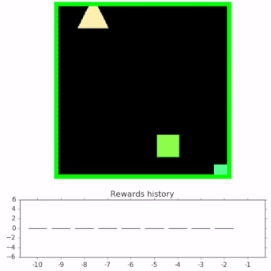
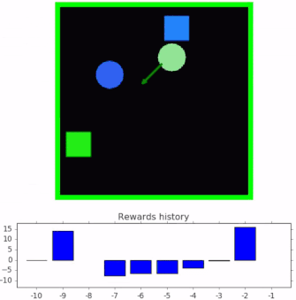
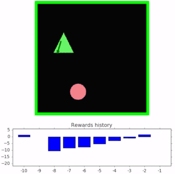

# Spriteworld: A Flexible, Configurable Reinforcement Learning Environment

## Description

Spriteworld is a python-based RL environment that consists of a 2-dimensional
arena with simple shapes that can be moved freely. This environment was
developed for the COBRA agent introduced in the paper ["COBRA: Data-Efficient
Model-Based RL through Unsupervised Object Discovery and Curiosity-Driven
Exploration" (Watters et al., 2019)](https://arxiv.org/abs/1905.09275). The
motivation for the environment was to provide as much flexibility for
procedurally generating multi-object scenes while retaining as simple an
interface as possible.

Spriteworld sprites come in a variety of shapes and can vary continuously in
position, size, color, angle, and velocity. The environment has occlusion but no
physics, so by default sprites pass beneath each other but do not collide or
interact in any way. Interactions may be introduced through the action space,
which can update all sprites each timestep. For example, the DiscreteEmbodied
action space (see `spriteworld/action_spaces.py`) implements a rudimentary form
of physics in which an agent's body sprite can adhere to and carry sprites
underneath it.

There are a variety of action spaces, some of which are continuous (like a
touch-screen) and others of which are discrete (like an embodied agent that
takes discrete steps).

## Example Tasks

Below are three of the tasks used in the
[COBRA paper](https://arxiv.org/abs/1905.09275).

Goal-finding task. The agent must bring the target sprites (squares) to the
center of the arena.



Clustering task. The agent must arrange the sprites into clusters according to
their color.



Sorting task. The agent must sort the sprites into goal locations according
to their color (each color is associated with a different goal location).



## Installation

Spriteworld can be installed using `pip`:

```bash
pip install git+https://github.com/deepmind/spriteworld.git
```

or alternatively by checking out a local copy of our repository and running:

```bash
git clone https://github.com/deepmind/spriteworld.git
pip install spriteworld/
```

## Getting Started

#### Prerequisites

Spriteworld depends on `numpy`, `six`, `absl`, `PIL`, `matplotlib`, `sklearn`,
and `dm_env`.

#### Running The Demo

Once installed, you may familiarize yourself with Spriteworld through `demo.py`:

```bash
python /path/to/local/spriteworld/demo.py
```

This will run a cluster-by-color task with a drag-and-drop action space. There
are a number of tasks specified in the `spriteworld/configs` directory, each of
which can be run with the demo by modifying the `--config` flag. Note that some
tasks (namely `spriteworld/configs/examples/goal_finding_embodied.py`) use an
embodied agent instead of the drag-and-drop action space.

#### Creating Your Own Task

In `spriteworld/tasks.py` are three tasks: `FindGoalPosition`, `Clustering`, and
`MetaAggregated`. These can be configured and combined in numerous ways to
create a wide variety of tasks, including all of those used in the
[COBRA paper](https://arxiv.org/abs/1905.09275). In particular, see
`spriteworld/configs/cobra/sorting.py` for a non-trivial combination of
goal-finding tasks.

You may create new tasks be re-using these building blocks, or creating entirely
new types of tasks (just be sure to inherit from
`spriteworld/tasks.AbstractTask`).

#### Running An Agent

See `example_run_loop.py` for an example of how to run a random agent on a
Spriteworld task. See `spriteworld/gym_wrapper.py` if you prefer the OpenAI Gym
environment interface.

## Additional Use-Cases

Spriteworld can be used for purposes other than reinforcement learning. For
example, it was used to generate the image datasets with controlled factor
distributions presented in the paper ["Spatial Broadcast Decoder: A Simple
Architecture for Learning Disentangled Representations in VAEs" (Watters et al.,
2019)](https://arxiv.org/abs/1901.07017). It can also be easily extended to
generate datasets of objects interacting with simple physical forces (e.g.
spring, gravity, etc.), which are useful for research in unsupervised learning
of visual dynamics.

## Reference

If you use this library in your work, please cite it as follows:

```
@misc{spriteworld19,
author = {Nicholas Watters and Loic Matthey and Sebastian Borgeaud and Rishabh Kabra and Alexander Lerchner},
title = {Spriteworld: A Flexible, Configurable Reinforcement Learning Environment},
howpublished = {https://github.com/deepmind/spriteworld/},
url = {https://github.com/deepmind/spriteworld/},
year = "2019",
}
```

## Disclaimers

This is not an officially supported Google product.
